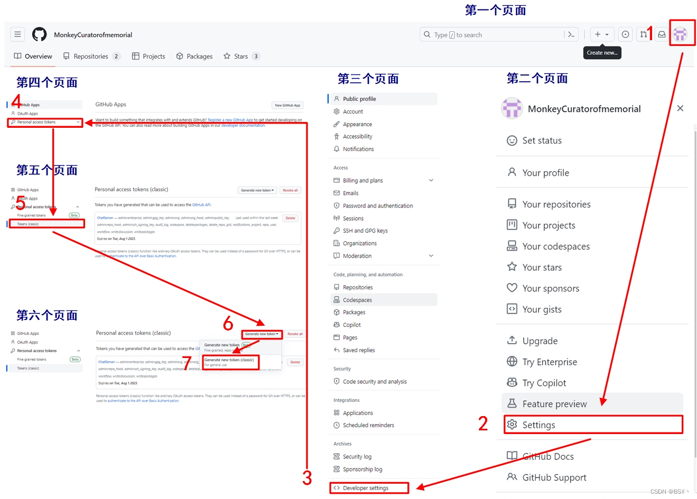
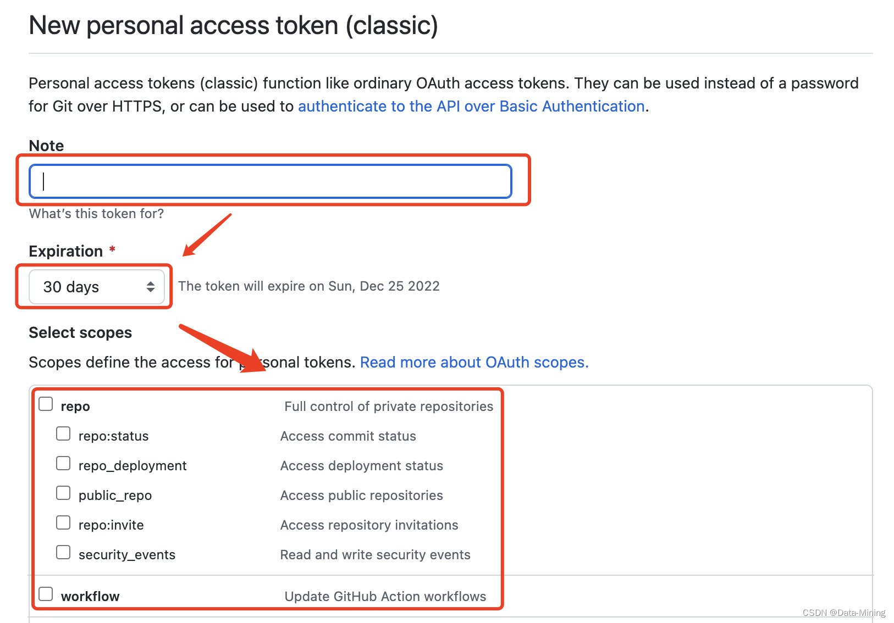

## 问题一

现象:
* Git 连接问题：fatal: unable to access ‘https://github.com/...../‘: Failed to connect to git

原因：
* 1. DNS 解析出现问题

* 2. 防火墙或代理设置

解决
* 1. 清除缓存：
        在 cmd 窗口输入 ipconfig/flushdns ，清除缓存后再重新进行 git 操作即可   --> 较为实用，需要多清除几次使用

* 2. 取消代理：
        git config --global --unset http.proxy
        
        git config --global --unset https.proxy


## 问题二
现象：
* npm WARN config global `--global`, `--local` are deprecated. Use `--location=global` instead

原因：
* npm 的全局配置--global, --local已弃用。需使用--location=global替代 。

解决：
 *  1、找到node的安装路径
 *  2、修改npm，npm.cmd文件, 成 prefix --location=global


## 问题三

现象：
* git init 出现 Using ‘master‘ as the name for the initial branch. This default branch name报错

```sh

$ git init
warning: templates not found in /home/ja/share/git-core/templates
hint: Using 'master' as the name for the initial branch. This default branch name
hint: is subject to change. To configure the initial branch name to use in all
hint: of your new repositories, which will suppress this warning, call:
hint:
hint:   git config --global init.defaultBranch <name>
hint:
hint: Names commonly chosen instead of 'master' are 'main', 'trunk' and
hint: 'development'. The just-created branch can be renamed via this command:
hint:
hint:   git branch -m <name>
Initialized empty Git repository in /tmp/new/.git/

```

原因：
* git配置默认分支问题

解决：
* 一般情况下 我们先设置默认分支为master级别 

    ```sh
    git config --global init.defaultBranch master
    ```


## 问题四

现象：
* npm ERR! code CERT_HAS_EXPIRED npm ERR! errno CERT_HAS_EXPIRED npm ERR! request to

原因：
* 证书过期

解决：
 * 清除npm缓存

    ```sh
    # 清除npm缓存
    npm cache clean --force
    # 取消ssl验证：
    npm config set strict-ssl false
    # 之后再npm install 
    ```


## 问题五

现象:
* fatal: Authentication failed for ‘https://github.com/*/*.git/‘

原因：
* github 的认证策略发生了改变，在 2021年8月13日 的时候，用户名加密码的认证方式被去掉了，换成了 个人令牌（Personal Access Token）的校验方式。

解决：
* 方案一： 
    

    ```sh
    填写生成令牌的目的，然后选择令牌的有效期，最后勾选令牌的作用范围（可以全部勾选，也可按需勾选）
    ```
    
    

    ```sh
    # 创建好令牌token后，一定保存好！！！，只有创建好的时候能见到，之后都看不到啦

    # 通过个人令牌访问自己的仓库
    git remote set-url origin https://<token>@github.com/<username>/<reponame>.git
    
    # 参数：
    # token：创建好的令牌号
    # username：gtihub起的名字
    # reponame：远程仓库的名字

    # 然后再正常提交即可成功。
    git push origin master
    ```

* 方案二： 
    ```sh
    可使用VSCode的终端中直接使用git，VSCode依然会通过浏览器或者github插件去以用户和密码的方式验证
    ```