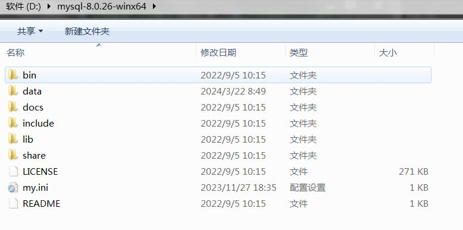
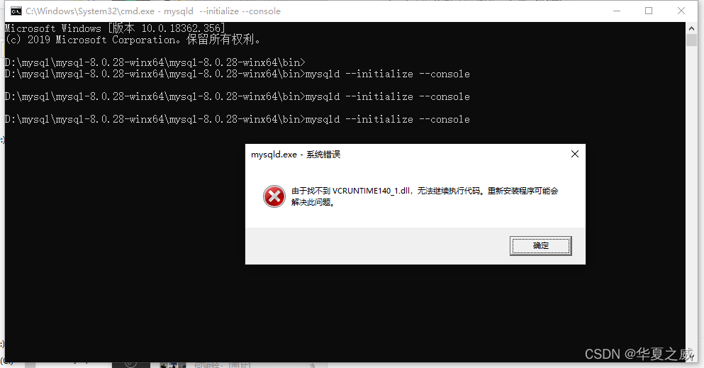

## 确认本地是否安装mysql

```sh

# 1. 按【win+r】快捷键打开运行；
# 2. 输入services.msc，点击【确定】；
# 3. 在打开的服务列表中查找mysql服务，如果没有mysql服务，说明本机没有安装mysql，反之，说明本机安装了mysql服务

```

## 下载mysql安装包

```sh

# mysql安装包下载链接
https://dev.mysql.com/downloads/mysql/

```



## 添加配置文件

```sh
# 1. 下载好mysql安装包后，将其解压到指定目录，并记下解压的目录，后续用于环境变量配置：
# 2. 在bin目录同级下创建一个文件，命名为my.ini
# 3. 编辑my.ini文件，文件内容如下：
```

```ini
[mysqld]
# 设置3306端口
port=3306
# 设置mysql的安装目录 ---这里输入你安装的文件路径----
basedir=E:\czw_soft\soft\mysql-8.0.28-winx64\mysql-8.0.28-winx64
# 设置mysql数据库的数据的存放目录
datadir=E:\mysql\data
# 允许最大连接数
max_connections=200
# 允许连接失败的次数。
max_connect_errors=10
# 服务端使用的字符集默认为utf8
character-set-server=utf8
# 创建新表时将使用的默认存储引擎
default-storage-engine=INNODB
# 默认使用“mysql_native_password”插件认证
#mysql_native_password
default_authentication_plugin=mysql_native_password
[mysql]
# 设置mysql客户端默认字符集
default-character-set=utf8
[client]
# 设置mysql客户端连接服务端时默认使用的端口
port=3306
default-character-set=utf8
```

```sh
# 有两点需要注意修改的：
    # A、basedir这里输入的是mysql解压存放的文件路径
    # B、datadir这里设置mysql数据库的数据存放目录
```


## 安装mysql

```sh

# 打开cmd进入mysql的bin文件下，依次执行命令

# 1. 安装mysql  安装完成后Mysql会有一个随机密码

mysqld --initialize --console

# 执行结果会生成mysql的随机密码，这个记下来
# 注意：
# A、一定要保存截图，里面有安装的初始密码！！！！
# B、安装过程中可能会提示以下问题
    # 可以直接去网上下载该文件，放到C:\Windows\System32下面即可：

```


```sh

# 2. 安装mysql服务并启动   
mysqld --install mysql

```


## 修改mysql密码

```sh
# 1. 点击桌面我的电脑，右键选择管理进去, 找到mysql服务，右键启动
# 2. 继续在cmd上执行以下命令
mysql -uroot -p

# 3. 回车后输入上面安装时保存的初始密码，进入mysql里面
# 4. 在mysql里面继续执行以下命令

# 修改密码为123mysql， 密码可以自行设置
ALTER USER 'root'@'localhost' IDENTIFIED BY '123mysql';

# 5. 回车按照指引执行完后，代表密码修改成功，再输入exit; 退出即可

```

## 配置环境变量

```sh

# 1. 进入电脑的环境变量
# 2. 新建系统变量：
    # 变量名：MYSQL_HOME
    # 变量值：文件的解压目录
# 3. 修改系统的path变量:
    # 编辑path，进去后添加 %MYSQL_HOME%\bin
```